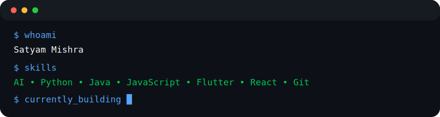

<div align="center">


#  Hi, I'm Satyam Mishra


<p>

<a href="https://github.com/devSatyamm">

</a>

<a href="https://linkedin.com/in/satyamofficial">

</a>


</p>

</div>

<p align="center">

</p>

<p align="center">


</p>

<p align="center">

</p>

<h2 align="center">About Me</h2>

<p align="center">



</p>

```yaml
Name: Satyam Mishra

Education:
  B.Tech Computer Science

University:
  Manipal University Jaipur

Location:
  India

Interests:
  - Artificial Intelligence
  - Full Stack Development
  - Software Engineering
  - Open Source

Currently Building:
  - AI Products
  - Modern Web Applications
  - Developer Tools

Currently Learning:
  - System Design
  - Backend Development
  - Cloud Technologies
```

<p align="center">


</p>

# ⚡ Tech Arsenal

<div align="center">


</div>

<p align="center">


</p>

# 🚀 Featured Projects

<!-- ======================================================= -->
<!--                  FEATURED PROJECTS                       -->
<!-- ======================================================= -->

<h2 align="center">Featured Projects</h2>


<!-- ===================================================== -->
<!--                FEATURED PROJECTS                      -->
<!-- ===================================================== -->

<p align="center">

</p>

<h2 align="center">Featured Projects</h2>

<table>
<tr>
<td width="50%" valign="top">

## 🚀 MarketMind

> AI-powered financial intelligence platform that helps users make smarter financial decisions using AI.

**Features**

- 📰 AI News Analysis
- 🏛 Government Scheme Oracle
- 💰 Funding Database
- 📈 Investment Simulator

**Tech**

`JavaScript` `HTML` `CSS` `AI`

<br>

<a href="https://marketmind-world.vercel.app/">

</a>

<a href="https://github.com/devSatyamm/MarketMind">

</a>

</td>

<td width="50%" valign="top">

## 🔒 ThreatPilot

> AI-powered security testing platform for automated vulnerability assessment.

**Features**

- 🔍 Security Analysis
- 🤖 AI Assisted Testing
- 📑 Smart Reports
- 🛡 Vulnerability Detection

**Tech**

`Python`
`AI`

<br>

<a href="https://github.com/devSatyamm/ThreatPilot">

</a>

</td>

</tr>

<tr>

<td width="50%" valign="top">

## 🎓 CampusConnect

A student-first collaboration platform.

**Features**

- 📚 Notes
- 🎉 Events
- 👥 Communities
- 📢 Resources

**Tech**

`Flutter`
`Firebase`

<br>

<a href="https://github.com/devSatyamm/campusconnect">

</a>

</td>

<td width="50%" valign="top">

## 🌐 Portfolio

My personal developer portfolio showcasing projects and skills.

**Tech**

`HTML`
`CSS`
`JavaScript`

<br>

<a href="https://github.com/devSatyamm/Satyam-Portfolio">

</a>

</td>

</tr>

</table>

# 📊 Developer Dashboard

<p align="center">


</p>

<p align="center">


</p>


<p align="center">


</p>

# 🛣️ Developer Journey

```text
2025
│
├── Started Full Stack Development
├── Built MarketMind
├── Learned AI Integration
└── Built Personal Portfolio

2026
│
├── Built ThreatPilot
├── Developed CampusConnect
├── Exploring System Design
└── Building Better Software

Next
│
├── Cloud
├── DevOps
├── AI Engineering
└── Open Source
```

<p align="center">


</p>

# 🐍 Contribution Snake

<p align="center">


</p>

<p align="center">


</p>

# 🤝 Let's Connect

<p align="center">

<a href="https://github.com/devSatyamm">

</a>

<a href="https://linkedin.com/in/satyamofficial">

</a>

</p>

<p align="center">


</p>

<div align="center">

### ⭐ Thanks for visiting!

*"Building software that solves real-world problems, one project at a time."*

</div>

<p align="center">
    
</p>
